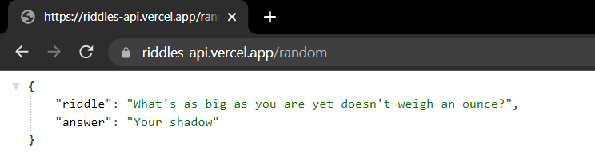

# Riddles REST API

>API - [https://riddles-api.vercel.app/random](https://riddles-api.vercel.app/random)

## Development - How to setup locally?

- **With Docker** - Easy way
```bash
docker build -t riddles-api .
```
```bash
docker run -it -p 9090:9090 riddles-api
```

- **Without Docker**

1. Check if `node` is installed
```bash
node -v

# if this throws error, then install nodejs
# link - https://nodejs.org/en/download/
```
2.  After cloning the repository, `cd` to project folder
```bash
npm install 
```
3. After all packages are installed, start the server
```bash
npm start

# or
nodemon server.js
```

## Usage

